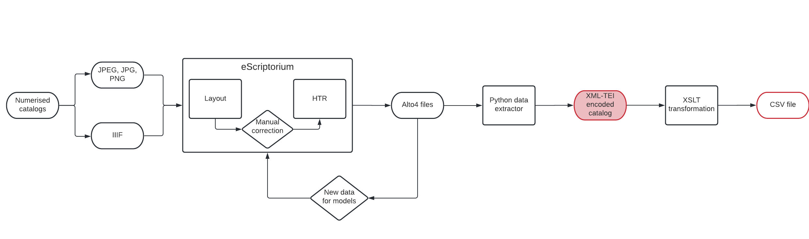

# TEI Catalogs Production

This repository contains TEI files of 19th and 20th exhibition catalogs. 

## Production
Those files were created thanks to this pipeline:

  

Segmentation and transcription were done in eScriptorium, using models trained with Kraken on datasets from [here](https://github.com/Juliettejns/cataloguesSegmentationOCR) and [here](https://github.com/Juliettejns/cataloguesOCR). 
Python data extraction which transformed the ALTO4 files extracted from eScriptorium to TEI files is accessible [here](https://github.com/Juliettejns/extractionCatalogs).

Manual correction is done between each step of the pipeline.
 Since the Layout analysis has been corrected for each catalogs, ALTO4 files extracted from eScriptorium can then be used to train a more efficient segmentation model.

## TEI files

The TEI files were built in order to stick to the [ODD](https://github.com/carolinecorbieres/ArtlasCatalogues/blob/master/5_ImproveGROBIDoutput/ODD/ODD_VisualContagions.xml) done by Caroline Corbières.

## Repository
This repository presents, for each catalog, images, alto4 files extracted from eScriptorium, TEI and csv file.

## Credits
This repository is developed by Juliette Janes, intern of the [Artl@s](https://artlas.huma-num.fr/fr/) project, with the help of Simon Gabay under the supervision of Béatrice Joyeux-Prunel.

## Licence
Images from catalogs published prior 1920 and transcriptions are CC-BY.  
The other images are extracts of catalogs published after 1920 and are the intellectual property of their productor. 

## Cite this repository
Juliette Janes, Simon Gabay, Béatrice Joyeux-Prunel, _TEICatalogs production_, 2021, Paris: ENS Paris https://github.com/Juliettejns/TEIcatalogs/

## Contacts
If you have any questions or remarks, please contact juliette.janes@chartes.psl.eu and simon.gabay@unige.ch.
